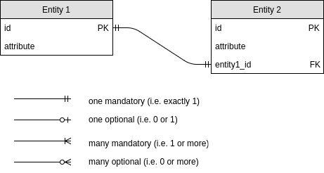

# Relational model

The _relational model_ specifies a mathematically grounded way to store, organize, and manipulate data in a set of tables (_relations_, which also comprise views and sequences). The schema specifies the names, data types and constraints of the columns (_fields_) that make up the table, and the actual data are the rows (_records_) filling it. This model is the foundation of how relational databases persist data.

A _conceptual schema_ is a high-level design of entities (any recognizable objects in the real world) and their relationships, whereas a _physical schema_ is a database-specific design focused on the implementation of the conceptual schema.

Usually, different kinds of entities are modeled through separate tables, and each row represents an entity instance. A _relationship_ describes a connection between these entities (e.g. between customers and orders, and between orders and products), more physically by cross-referencing columns using primary- and foreign-key constraints. The cardinality of such a relationship specifies the number of objects on each side of the relationship, and modality indicates whether a relationship is optional or required.

* _One-to-one relationships_ are implemented by means of a unique foreign key.   

* _One-to-many relationships_ are implemented by a non-unique foreign key, where the _many_-side will have a foreign key identifying the _one_-side.

* _Many-to-many relationships_ are implemented as a cross-reference table T3 that uses two foreign keys, to primary key of T1 and primary key of T2, together forming the primary key of T3.

**Visualization:** [Crow's Foot Notation](http://www.conceptdraw.com/How-To-Guide/picture/erd-diagrams-software-tools-for-design-element-crows-foot/Crows-Foot-notation-symbols.png)

# Keys

Keys are specific kinds of constraints (i.e. rules on what kind of data is allowed in a column) and as such part of the schema definition. Their main purpose is to  ensure data integrity in the sense that data records can be uniquely identified and referenced. 

## Primary keys

A _primary key_ is a collection of one or more columns that uniquely identifies each row in a table. In other words, the constraint `PRIMARY KEY` is the same as `NOT NULL UNIQUE`.

Each relational table can have only one primary key. When a primary key is created, also an index is created, that facilitates data selection and sorting based on the primary key column.

Keys can be _natural_, i.e. one or several columns that happen to be unique, or more likely _surrogate_, i.e. created for the specific purpose of being a unique identifier, such as auto-incrementing integers or UUIDs.

## Foreign keys

A _foreign key_ is a column that refers to the primary key of another table, thereby acting as a cross-reference between tables.
Foreign key columns obviously need to have the same data type as the primary key column of the other table, and in most DBMS the foreign key constraint also prevents foreign key values that don't exist as primary key value (_referential integrity_).

As opposed to primary keys, foreign keys don't need to be unique, can be `NULL`, and there can be arbitrarily many of them in one table.

A column can be both a primary and a foreign key.

# Normalization

The goal of _normalization_ is to design the schema in a way that it avoids or at least minimizes anomalies, mainly by distributing information across separate tables.

* _Update anomaly:_ If data is duplicated, updating it in one place while not updating it in another leads to inconsistencies, e.g. leading to different answers to a query that should only have one.
* _Insertion and deletion anomaly:_ When storing particular information only together with other information, e.g. contact details in an events table, then that information is not available independently, i.e. it can only be inserted when other information is inserted, and is lost when that other information is deleted.    
