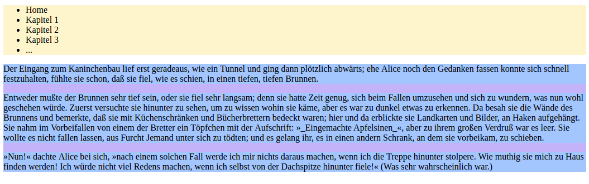
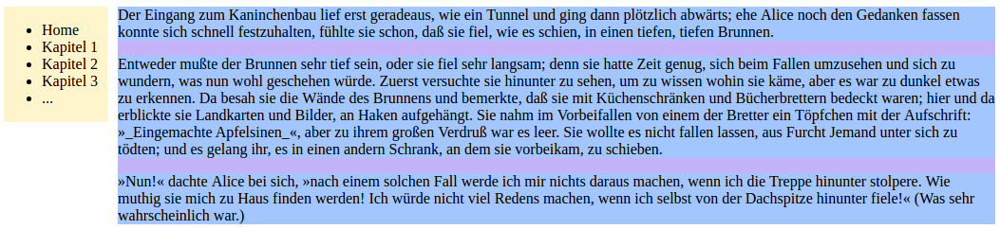

# Float

Originally intended for elements like images that text should flow around, no matter what size they have.

See: https://css-tricks.com/all-about-floats/

The `float` property removes an element from the _normal_ flow of a document, and moves it to the left or right edge of its parent element (or the page if there is no parent). It requires an element to be a block element, and will adapt its `display` value accordingly if it isn't.

Non-floated elements appearing after the floated ones will be positioned in the normal flow, and ignore the floated ones - only their content wraps around the floated ones. Example:
```html
<nav>
  <ul>
    <li>Home</li>
    <li>Kapitel 1</li>
    <li>Kapitel 2</li>
    <li>Kapitel 3</li>
    <li>...</li>
  </ul>
</nav>

<main>
  <p>...</p>
  <p>...</p>
  <p>...</p>
</main>
```
Before floating `nav` to the left:

After floating `nav` to the left:


In order for a non-floated box to behave as if the floated one was in the normal flow, it has to clear the float with `clear: both | left | right`.

Note that when floating an element, order in the HTML document matters. If, for example, an image is first removed from the normal flow, then the following text will wrap around it (see https://alistapart.com/d/css-floats-101/example_h.html):
```html
<div>
  
  <p>
</div>
```
But if the text is first set and the image is removed from the normal flow afterwards, it will affect the following elements but not the text (see https://alistapart.com/d/css-floats-101/example_i.html):
```html
<div>
  <p>
  
</div>
```

Also note that since floated elements are not in the normal flow, they don't affect the size of their parent element. Therefore containers with only floated elements in them, collapse - as far as the container is concerned, it's empty. That's also the reason why the image in [the second example](https://alistapart.com/d/css-floats-101/example_i.html) sticks out of the box.

In order to contain floats, the containing element needs an element that clears the float. This can be done using pseudo-elements (see [_micro clearfix_](http://nicolasgallagher.com/micro-clearfix-hack/)):
```css
.group::before,
.group::after {
  content: "";
  display: table;
}
.group::after {
  clear: both;
}
/* where class="group" can now be used on any parent element containing floats */
```
An alternative is to use `overflow: hidden` on the container, if it contains only floated elements and nothing else.

Floated elements without a specified width will take up as much space as their content needs.

## Column layout with floats

In the above HTML example, applying a left margin to `main` leads to:

Since the margin area takes the background color of the containing element, this gives the impression of two columns.  

## Horizontal lists with floats

Each floated box is taken out of the normal flow and floated as far up and left/right as possible, so consecutive floated boxes will appear next to each other (until they fill the width of their containing element, then they begin to wrap, called _float drop_).

```html
<ul>
  <li>Item 1</li>
  <li>Item 2</li>
  <li>Item 3</li>
  <li>Item 4</li>
</ul>
```
When applying `float: left` to `li`:

